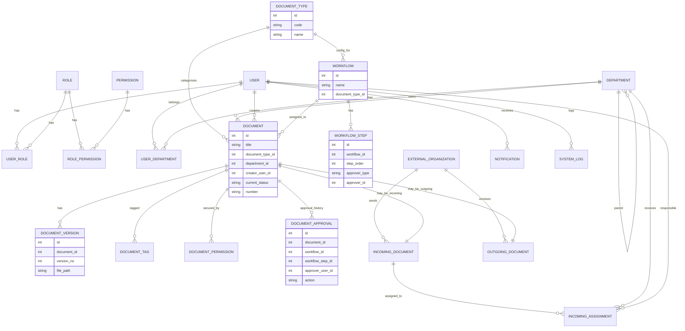

# ERD Detailed Specification

```mermaid
erDiagram

  USER ||--o{ USER_ROLE : has
  ROLE ||--o{ USER_ROLE : has
  ROLE ||--o{ ROLE_PERMISSION : has
  PERMISSION ||--o{ ROLE_PERMISSION : has

  USER ||--o{ USER_DEPARTMENT : belongs
  DEPARTMENT ||--o{ USER_DEPARTMENT : has
  DEPARTMENT ||--o{ DEPARTMENT : parent

  DOCUMENT_TYPE ||--o{ DOCUMENT : categorizes
  DEPARTMENT ||--o{ DOCUMENT : owns
  USER ||--o{ DOCUMENT : creates

  DOCUMENT ||--o{ DOCUMENT_VERSION : has
  DOCUMENT ||--o{ DOCUMENT_TAG : tagged
  DOCUMENT ||--o{ DOCUMENT_PERMISSION : secured_by
  DOCUMENT ||--o{ DOCUMENT_APPROVAL : approval_history

  WORKFLOW ||--o{ WORKFLOW_STEP : has
  DOCUMENT_TYPE ||--o{ WORKFLOW : config_for
  WORKFLOW ||--o{ DOCUMENT : assigned_to

  EXTERNAL_ORGANIZATION ||--o{ INCOMING_DOCUMENT : sends
  EXTERNAL_ORGANIZATION ||--o{ OUTGOING_DOCUMENT : receives

  DOCUMENT ||--|| INCOMING_DOCUMENT : may_be_incoming
  DOCUMENT ||--|| OUTGOING_DOCUMENT : may_be_outgoing

  INCOMING_DOCUMENT ||--o{ INCOMING_ASSIGNMENT : assigned_to
  DEPARTMENT ||--o{ INCOMING_ASSIGNMENT : receives
  USER ||--o{ INCOMING_ASSIGNMENT : responsible

  USER ||--o{ NOTIFICATION : receives
  USER ||--o{ SYSTEM_LOG : logs

  DOCUMENT_TYPE {
    int id
    string code
    string name
  }

  DOCUMENT {
    int id
    string title
    int document_type_id
    int department_id
    int creator_user_id
    string current_status
    string number
  }

  DOCUMENT_VERSION {
    int id
    int document_id
    int version_no
    string file_path
  }

  WORKFLOW {
    int id
    string name
    int document_type_id
  }

  WORKFLOW_STEP {
    int id
    int workflow_id
    int step_order
    string approver_type
    int approver_id
  }

  DOCUMENT_APPROVAL {
    int id
    int document_id
    int workflow_id
    int workflow_step_id
    int approver_user_id
    string action
  }
```
