# FlowDocker E-Office

Self-hosted document workflow, approval, and application-level PDF e-signing for teams that need tenant-scoped control, auditable process state, and portable storage.

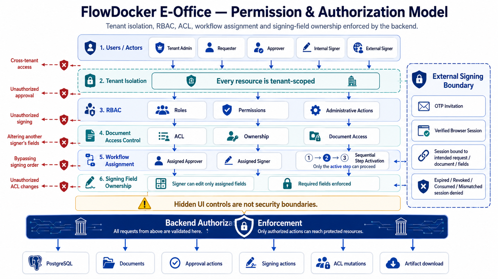

## Overview

FlowDocker E-Office takes a request from document setup through assigned approval, internal or external signing, asynchronous artifact generation, and authorized final PDF download. The verified runtime flow is **Request → Approval → Signing → Artifact → Completed**.

## Key Features

- Multi-tenant workspaces with backend-enforced isolation.
- RBAC, document ACL/ownership, and assigned approver/signer boundaries.
- Configurable document workflows and Document Type → Workflow mapping.
- Multi-step sequential approval with atomic activation of the next waiting step.
- Sequential internal signing and signing-field ownership enforcement.
- External invitation signing protected by OTP-verified sessions.
- My Tasks, notifications, audit history, email/webhook/outbox delivery, and deduplicated retries.
- Local filesystem and S3-compatible/MinIO artifact storage with persisted hash and metadata.

## Product Screenshots

| Dashboard | My Tasks & notifications |
|---|---|
| 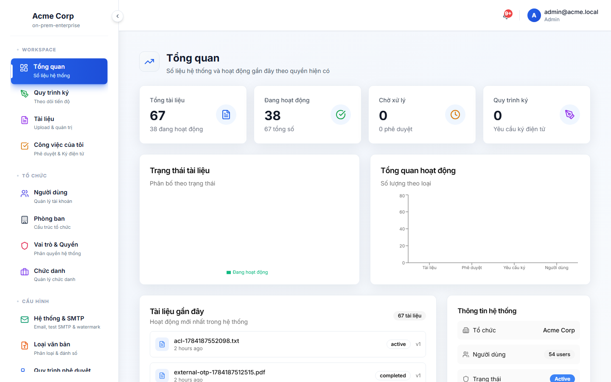 |  |

| Workflow configuration | Document Type mapping |
|---|---|
| 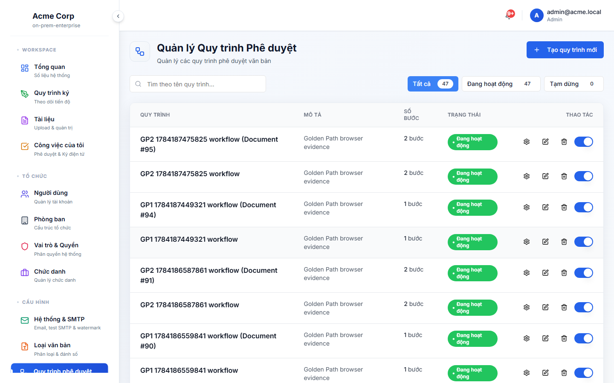 | 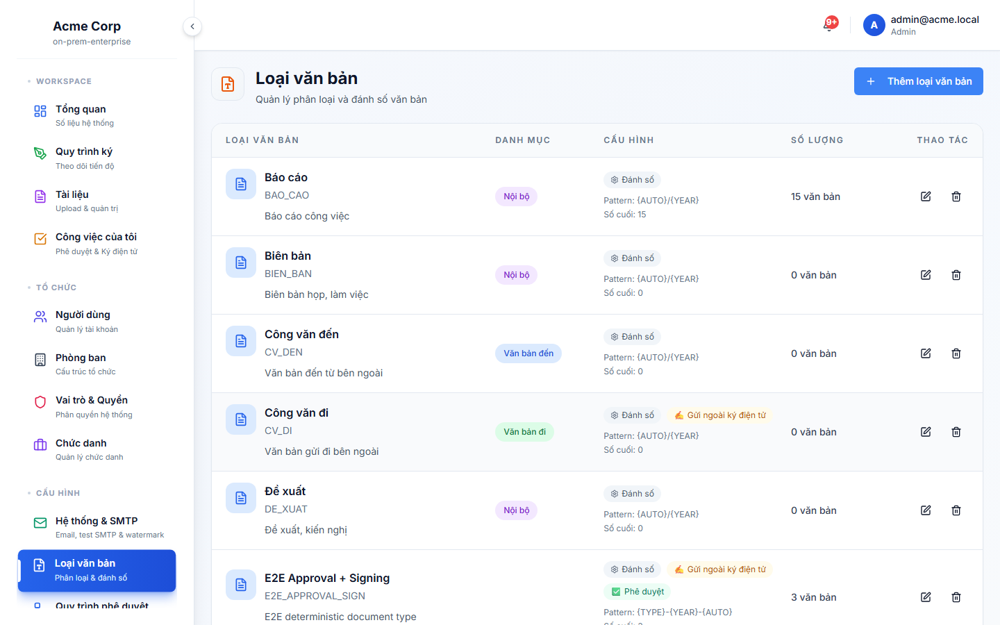 |

## How It Works


Create a request, select its Document Type, and submit it. The mapped workflow resolves assigned actors. Sequential approval records are materialized up front: only step one is active; later steps wait until the preceding approval completes. After all required approvals and signatures, the outbox worker generates and stores the signed artifact before marking the request completed.

| Request setup | Assigned approval |
|---|---|
| 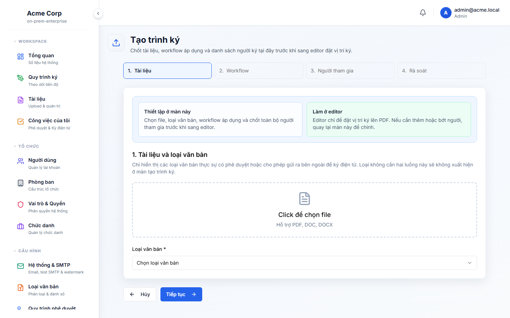 | 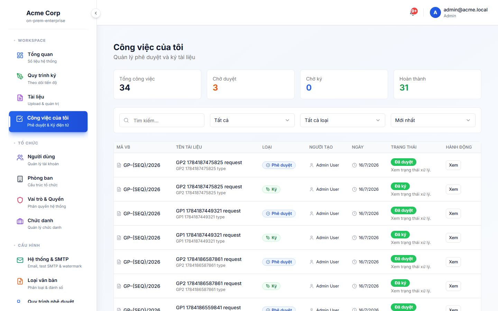 |

| Internal signing | Workflow status |
|---|---|
| 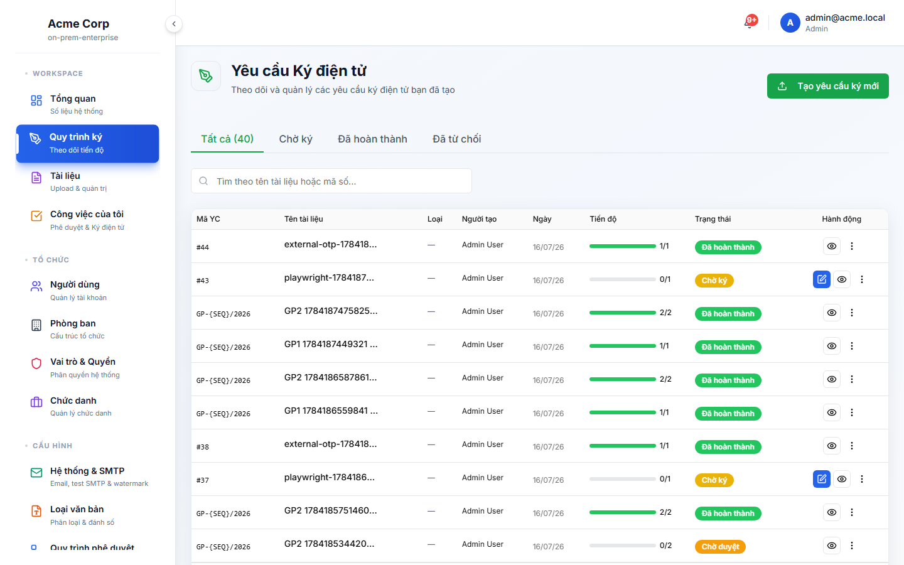 | 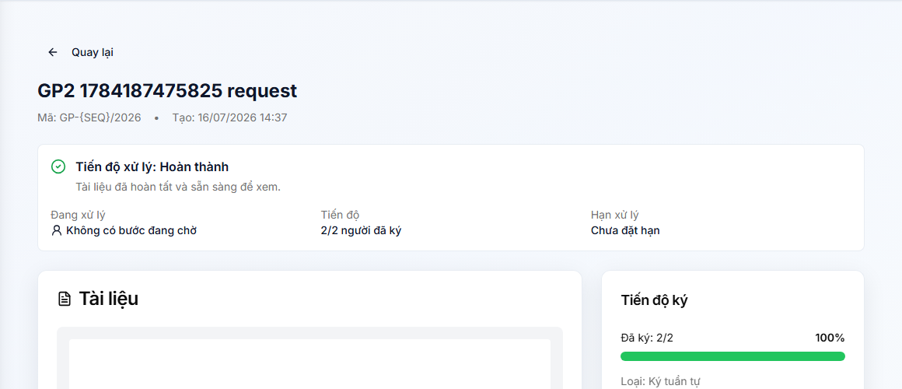 |

## System Setup

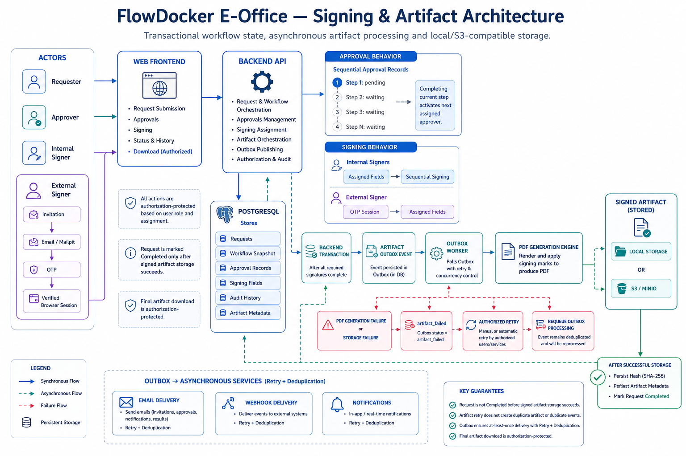

Tenant administrators configure master data, users and roles, workflows, document types, and the Document Type → Workflow mapping.

## Approval & E-Signing

Internal signing is constrained by signer order and assigned fields. External signing uses invitation and OTP session verification.

| Internal signing workspace | External signing workspace |
|---|---|
|  |  |

This project provides application-level visual PDF signing workflows. It is not represented as qualified PKI signing, PAdES compliance, or a regulatory certification.

## Permission & Authorization

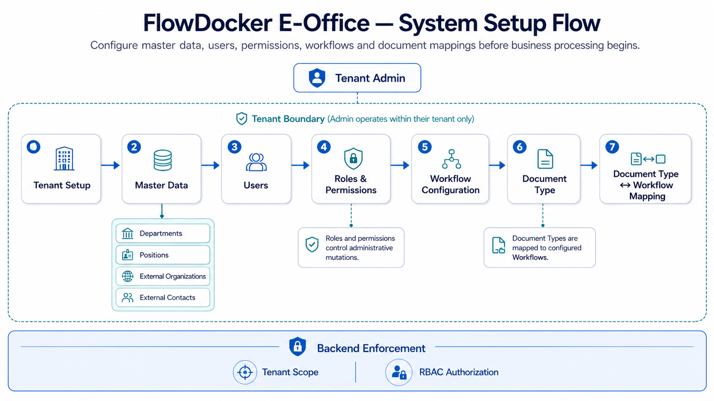

Tenant isolation, RBAC, ACL/ownership, workflow assignment, assigned approvers/signers, signing-field ownership, external OTP sessions, and backend authorization are the enforcement boundaries. Hidden UI controls are not security boundaries.

## Signing & Artifact Architecture

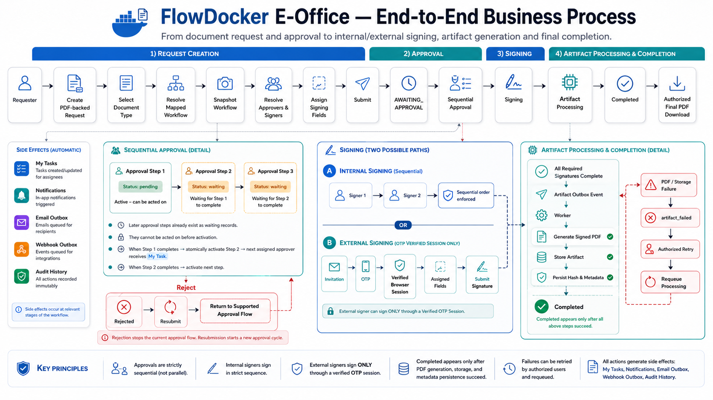

Signing completion writes an outbox event. The worker generates the PDF artifact, writes it to local or S3-compatible storage, persists hash/metadata, and only then completes the request. Artifact failures remain retryable failures rather than completed requests.

## Demo

[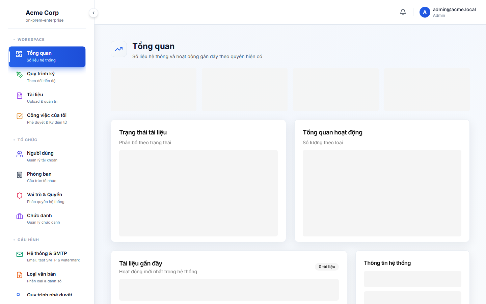](docs/assets/readme/demo/flowdocker-eoffice-demo.mp4)

## Architecture / Technology

Browser → Next.js frontend → Express/TypeScript API → PostgreSQL and Redis. The outbox worker processes notification, webhook, and artifact side effects. Storage is local by default and can be configured for S3-compatible services including MinIO.

## Quick Start

Choose one supported installation path:

- [Disposable local demo](INSTALL-DEMO.md)
- [Retained self-hosted / production deployment](INSTALL-PRODUCTION.md)
- [Backup and restore](docs/BACKUP-RESTORE.md)

For a local demo:

```bash
DEMO_ADMIN_PASSWORD='choose-a-unique-password' ./install.sh demo
```

Open `http://localhost:3000`; the API is available at
`http://localhost:4000`.

## Deployment guide (first-time self-hosting)

The canonical retained-deployment procedure is
[INSTALL-PRODUCTION.md](INSTALL-PRODUCTION.md). The summary below is intentionally
short so installation instructions have one source of truth.

### 1. Prepare the server

Install Docker Engine and the Docker Compose plugin using Docker's official installation guide. Confirm both commands work:

```bash
docker --version
docker compose version
```

Clone the repository and enter it:

```bash
git clone https://github.com/dinhvansh/e-office.git
cd e-office
```

### 2. Create production configuration

Never edit `.env.compose.example` directly. Copy it to `.env` and restrict access to it:

```bash
cp .env.compose.example .env
chmod 600 .env
```

Open `.env` and replace every `GENERATE_...` placeholder with a unique secret.
Make sure the password in `POSTGRES_PASSWORD` is also used in `DATABASE_URL`.
On Linux, a suitable random value can be generated with:

```bash
openssl rand -base64 48
```

At minimum, set these values:

```dotenv
POSTGRES_PASSWORD=<a-long-unique-password>
JWT_SECRET=<at-least-32-random-characters>
REFRESH_TOKEN_SECRET=<at-least-32-random-characters>
APP_BASE_URL=https://office.example.com
CORS_ORIGIN=https://office.example.com
NEXT_PUBLIC_API_URL=https://office.example.com/api/v1
NEXT_PUBLIC_API_BASE_URL=https://office.example.com/api/v1
AUTO_INIT_DB=false
SMTP_ENABLED=false
```

`AUTO_INIT_DB=true` is only for a disposable local demo. It can replace schema/data and seed accounts; do not use it in production. The normal container startup runs `prisma migrate deploy` automatically, so schema migrations are applied without destructive initialization.

### 3. Start the application

Build and start the services:

```bash
docker compose up -d --build
docker compose ps
```

Wait until `db`, `redis`, and `backend` are healthy. Inspect a failed service with:

```bash
docker compose logs --tail=200 backend
docker compose logs --tail=200 frontend
docker compose logs --tail=200 outbox-worker
```

By default the UI listens on `http://SERVER_IP:3000` and the API on `http://SERVER_IP:4000`. For a public installation, put a TLS reverse proxy such as Caddy, Nginx, or Traefik in front of them and expose only HTTPS. Route `/api/` to port 4000 and all other paths to port 3000. Keep `APP_BASE_URL`, `CORS_ORIGIN`, and both `NEXT_PUBLIC_API_*` values aligned with the public HTTPS URL, then rebuild the frontend after changing them.

### 4. Initial administrator setup

For a retained deployment, do not rely on demo seed data. Use the documented
one-time bootstrap command in
[INSTALL-PRODUCTION.md](INSTALL-PRODUCTION.md#5-bootstrap-the-first-tenant-owner).
The Open Source Core intentionally has no public self-service registration
endpoint.

After signing in, configure in this order:

1. Departments and eligible management positions.
2. Users, their departments, job positions, and roles.
3. Department manager/support managers where required.
4. Document types, numbering rules, workflows, and Document Type to Workflow mapping.
5. SMTP and storage settings, then send a non-sensitive test document through the full flow.

### 5. Storage, mail, and backups

The default Docker volumes are `db_data`, `backend_storage`, and `backend_backups`. Back them up before upgrades. A database-only backup example is:

```bash
./scripts/backup.sh
```

For object storage, configure the `S3_*` values in `.env` and set `FILE_STORAGE_DRIVER` to the supported S3-compatible driver for your deployment. For outbound mail, set `SMTP_ENABLED=true` only after configuring the SMTP host, credentials, sender address, and TLS setting. Treat `.env`, backups, and generated PDFs as sensitive data.

### 6. Upgrade safely

Back up the database and storage first. Then pull a reviewed version and rebuild:

```bash
git fetch origin
git pull --ff-only origin main
docker compose up -d --build
docker compose ps
```

The backend applies additive Prisma migrations at startup. Review release notes
and migration SQL before upgrading a production system. Do not use
`docker compose down -v` unless you explicitly intend to delete the database and
stored documents. See [docs/BACKUP-RESTORE.md](docs/BACKUP-RESTORE.md) before
upgrades.

## Storage

Local filesystem storage is the default. S3-compatible storage, including MinIO, is supported for source documents and final artifacts. Artifact metadata and hashes are persisted with the completed request.

## Project Status

`v0.1.0-alpha` is ready for evaluation in an isolated environment. Final UAT verified Golden Paths for internal approval/signing, sequential approval/signing, external OTP signing, artifact generation, local storage, and S3/MinIO. Production deployments still require their own operational, key-management, and compliance controls.

## Security

Never commit production secrets or SMTP credentials. See [SECURITY.md](SECURITY.md) and the deployment documentation before any production deployment. PDF annotations use Noto Sans for Vietnamese Unicode; configure approved fonts through `PDF_UNICODE_FONT_PATH` where required.

## License / Commercial Licensing

FlowDocker E-Office is source-available fair-code software, not OSI open source. The [Community Source License](LICENSE) permits internal self-hosting, internal modification, evaluation, learning, non-commercial personal use, development, testing, and contribution. Commercial hosted resale, managed-service resale, white-label resale, OEM/embedded distribution, and commercial redistribution as a competing product require a separate commercial license.

Trademark and logo rights are not granted automatically. See [COMMERCIAL-LICENSING.md](COMMERCIAL-LICENSING.md), [TRADEMARK.md](TRADEMARK.md), [CONTRIBUTING.md](CONTRIBUTING.md), and [SECURITY.md](SECURITY.md). FlowDocker™ and FlowDocker E-Office™ are trademarks of Nguyễn Đình Văn. Copyright © 2026 Nguyễn Đình Văn. All rights reserved.
