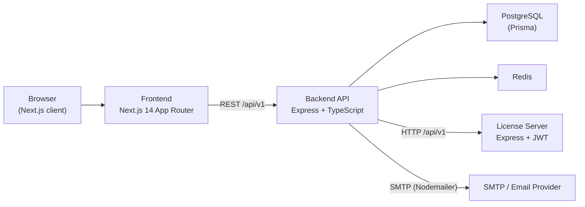

# Kiến trúc tổng quan E‑Office / WP Sign

Tài liệu này mô tả **kiến trúc hệ thống hiện tại** (E‑Signature base + phần Foundation của E‑Office), dựa trên code thực tế trong thư mục `backend/`, `frontend/` và `license-server/`.

---

## 1. Sơ đồ thành phần hệ thống



---

## 2. Sơ đồ cây thư mục (rút gọn)

```text
e-office/
  backend/                    # API chính (Express + TS + Prisma)
    src/
      app.ts                  # Khởi tạo Express app, middleware, router
      server.ts               # Khởi động HTTP server
      config/
        env.ts                # Đọc & validate biến môi trường (zod)
        prisma.ts             # PrismaClient singleton
        email.ts              # Cấu hình Nodemailer
      core/
        errors/api-error.ts   # Lỗi chuẩn hóa cho API
        middlewares/
          errorHandler.ts     # Xử lý lỗi chuẩn, trả JSON { success, error }
          requestContext.ts   # Gán requestId, startedAt
        utils/
          asyncHandler.ts     # Wrapper cho handler async
          fileStorage.ts      # Lưu file base64 ra storage
          response.ts         # Hàm ok()/error() response
      middleware/
        permission.ts         # requirePermission(), requireAnyPermission()
      router/
        v1.ts                 # Router chính /api/v1, mount tất cả modules
      modules/
        auth/                 # Đăng nhập, JWT, authGuard
        tenants/              # Thông tin tenant hiện tại
        users/                # User + RBAC
        departments/          # Cây phòng ban
        roles/                # Roles, permissions, user_roles
        documents/            # Upload & quản lý tài liệu
        signRequests/         # Phiếu yêu cầu ký
        signers/              # Người ký + OTP
        audit/                # Audit logs cho documents
        webhooks/             # Đăng ký webhook, emit sự kiện
        licenses/             # Kiểm tra license & giới hạn
        documentTypes/        # Loại văn bản (E‑Office foundation)
        numbering/            # Auto numbering rules (E‑Office foundation)
    prisma/
      schema.prisma           # Schema DB chi tiết (E‑Signature + E‑Office)

  frontend/                   # Next.js 14 dashboard
    app/
      layout.tsx              # Root layout, AppProviders
      (auth)/login/page.tsx   # Màn hình đăng nhập
      (dashboard)/layout.tsx  # Shell dashboard + sidebar
      (dashboard)/documents/page.tsx       # Upload & list documents
      (dashboard)/sign-requests/page.tsx   # Tạo & list sign requests
      (dashboard)/document-types/page.tsx  # Quản lý loại văn bản

  license-server/             # Service riêng cho license
    src/
      app.ts                  # Express app
      router.ts               # Mount licenseRouter
      modules/licenses/...    # Logic license offline (JWT)
```

---

## 3. Kiến trúc Backend (tóm tắt)

- Kiểu: **Modular Monolith** theo pattern Controller → Service → Repository.
- Mỗi module nằm trong `src/modules/{name}` với:
  - `{name}.routes.ts` – định nghĩa route, gắn `authGuard`, `requirePermission`.
  - `{name}.controller.ts` – xử lý HTTP, validate input.
  - `{name}.service.ts` – business logic, gọi nhiều repository/service khác.
  - `{name}.repository.ts` – truy vấn DB bằng Prisma.
- Cross‑cutting:
  - `config/env.ts` – cấu hình & validate env.
  - `config/prisma.ts` – PrismaClient singleton.
  - `core/errors` + `core/middlewares/errorHandler.ts` – xử lý lỗi chuẩn.
  - `middleware/permission.ts` – RBAC.
  - `core/utils/fileStorage.ts` – lưu file tài liệu.

---

## 4. Kiến trúc Frontend (tóm tắt)

- Next.js App Router với 2 layout:
  - `app/layout.tsx` – root layout, bọc `AppProviders`.
  - `app/(dashboard)/layout.tsx` – layout có sidebar, kiểm tra login.
- `AuthProvider`:
  - Lưu `tokens`, `user`, `tenant` vào React context + `localStorage`.
  - Cung cấp hàm `fetchJson(path, init)`:
    - Tự gắn `Authorization: Bearer <token>`.
    - Tự retry khi 401 bằng `/auth/refresh`.
- React Query quản lý mọi call API trong dashboard.

---

## 5. License Server (tóm tắt)

- Service nhỏ tách riêng:
  - Express app + `/api/v1` router.
  - `license.service.ts` sinh & validate offline license bằng JWT.
  - `license.store.ts` là in‑memory “DB” chứa license mẫu.
