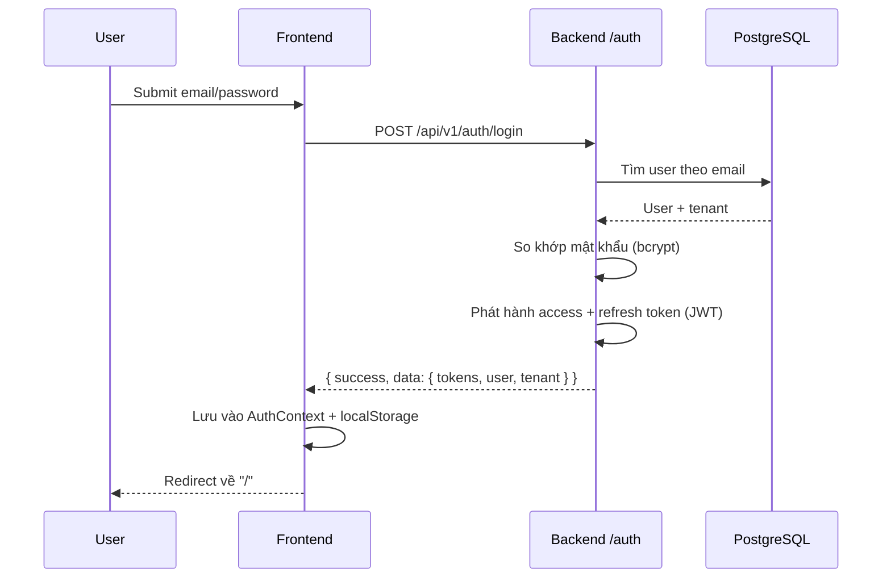
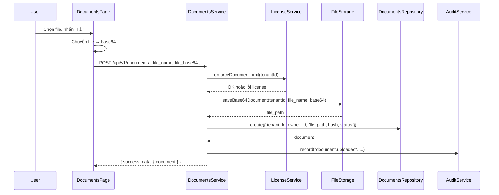
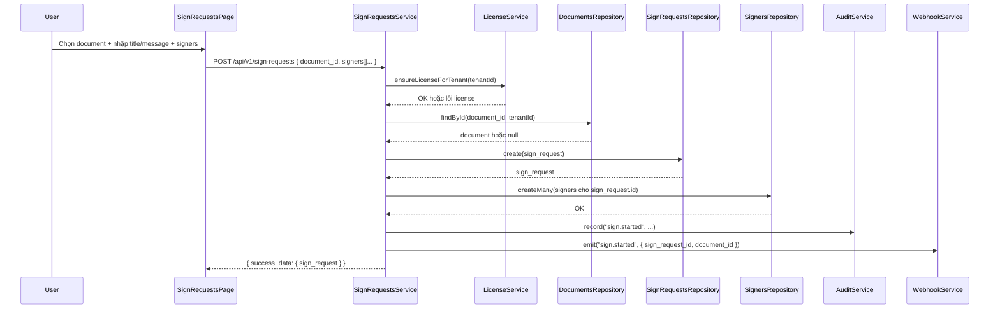
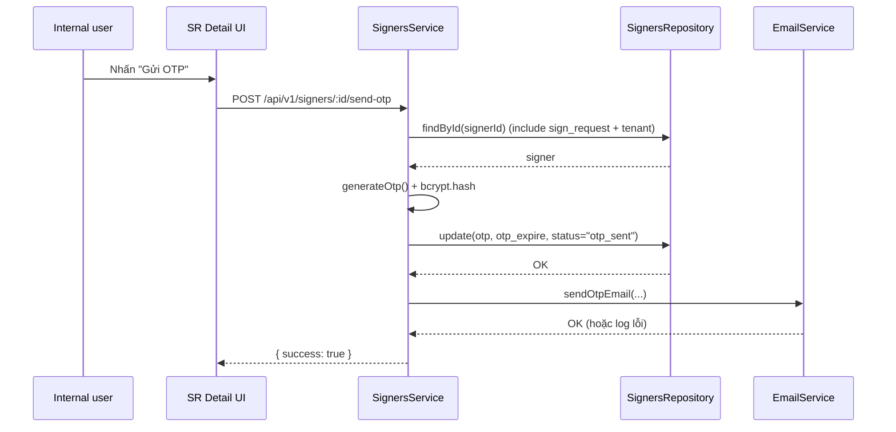
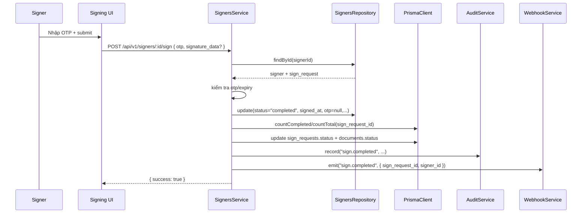
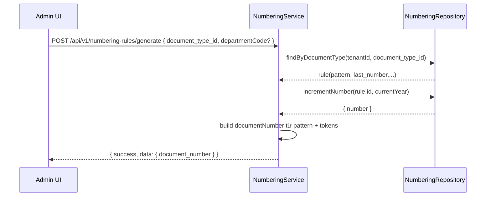

# Luồng dữ liệu chính (tóm tắt)

Tài liệu này mô tả các luồng dữ liệu quan trọng trong hệ thống hiện tại.

---

## 1. Flow đăng nhập

---

## 2. Flow upload tài liệu

Hiện tại metadata E‑Office (document_type, number, ...) **chưa** được sử dụng trong flow này.

---

## 3. Flow tạo yêu cầu ký

---

## 4. Flow gửi OTP & ký

### 4.1 Gửi OTP

### 4.2 Ký với OTP

---

## 5. Flow numbering (hiện tại)

Module `numbering` cung cấp API độc lập để generate/preview số văn bản, chưa gắn trực tiếp vào `DocumentsService`.

Để trở thành E‑Office hoàn chỉnh, số này cần được gắn vào `documents.document_number` khi upload/khởi tạo document.

