# Business Flows

Tài liệu này mô tả toàn bộ sơ đồ nghiệp vụ chính của hệ thống theo 2 góc nhìn:

- bản cho dev: bám sát module, route, trạng thái, RBAC, orchestration
- bản cho người dùng/nghiệp vụ: dễ đọc, tập trung vào ai làm gì và kết quả ra sao

Phạm vi bám theo các module hiện có trong repo:

- auth
- users
- departments
- positions
- roles
- document types
- numbering
- workflows
- documents
- document flow
- approvals
- sign requests
- signers
- public sign
- my tasks
- notifications
- audit
- external organizations
- settings
- webhooks
- tenants / license

## Phần 1. Bản Cho Dev

### 1. System Overview

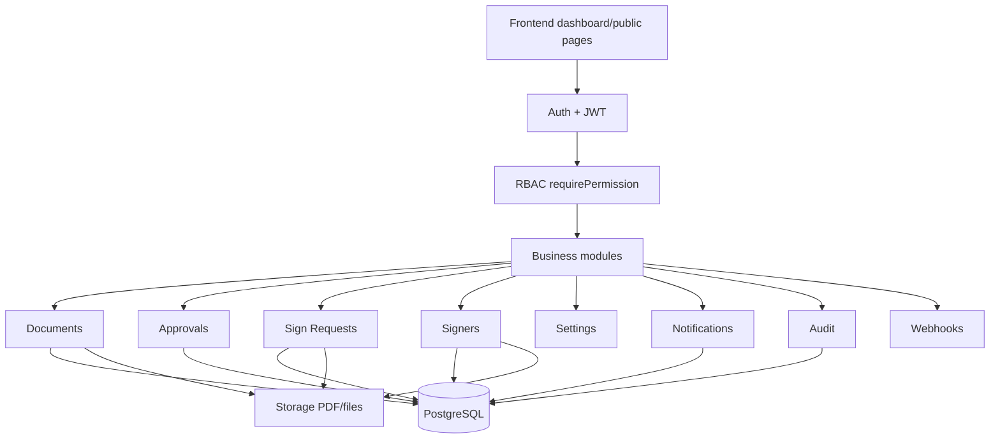
```mermaid
flowchart TD
    A[Frontend dashboard/public pages] --> B[Auth + JWT]
    B --> C[RBAC requirePermission]
    C --> D[Business modules]

    D --> E[Documents]
    D --> F[Approvals]
    D --> G[Sign Requests]
    D --> H[Signers]
    D --> I[Settings]
    D --> J[Notifications]
    D --> K[Audit]
    D --> L[Webhooks]

    E --> M[(PostgreSQL)]
    F --> M
    G --> M
    H --> M
    J --> M
    K --> M

    E --> N[Storage PDF/files]
    G --> N
    H --> N
```

### 2. Auth Flow

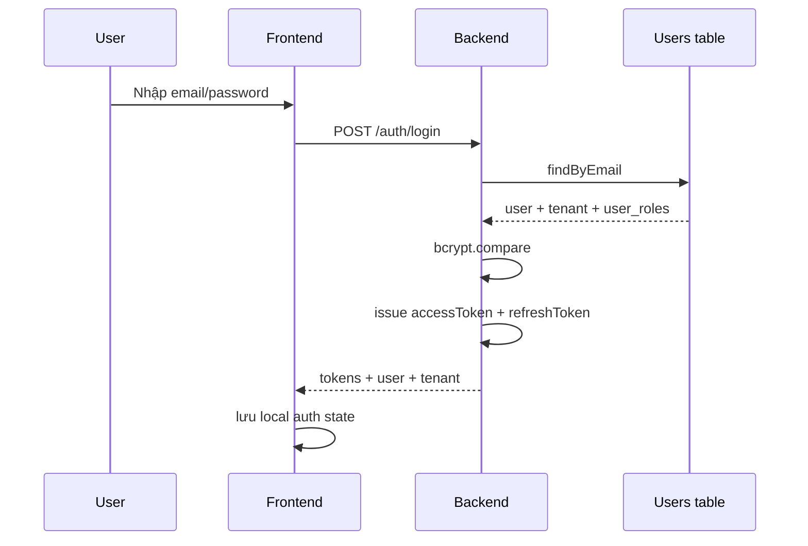
```mermaid
sequenceDiagram
    participant U as User
    participant FE as Frontend
    participant BE as Backend
    participant DB as Users table

    U->>FE: Nhập email/password
    FE->>BE: POST /auth/login
    BE->>DB: findByEmail
    DB-->>BE: user + tenant + user_roles
    BE->>BE: bcrypt.compare
    BE->>BE: issue accessToken + refreshToken
    BE-->>FE: tokens + user + tenant
    FE->>FE: lưu local auth state
```

### 3. Registration / Pending Approval Flow

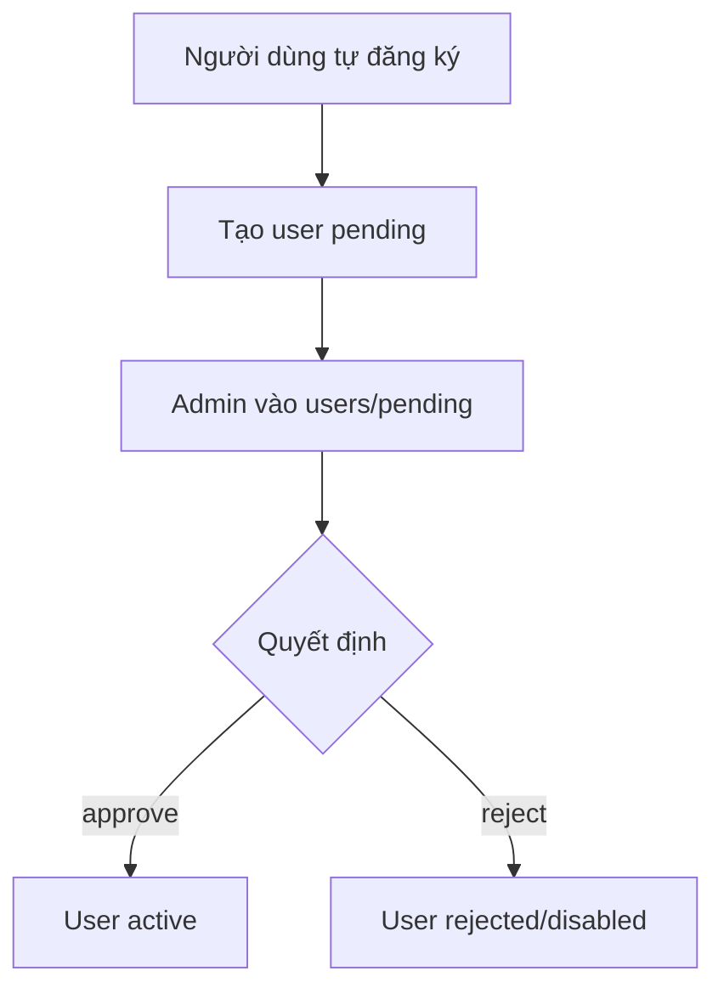
```mermaid
flowchart TD
    A[Người dùng tự đăng ký] --> B[Tạo user pending]
    B --> C[Admin vào users/pending]
    C --> D{Quyết định}
    D -- approve --> E[User active]
    D -- reject --> F[User rejected/disabled]
```

### 4. RBAC Flow

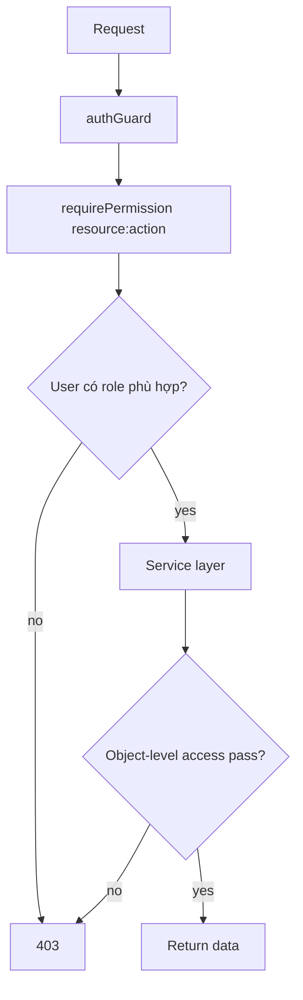
```mermaid
flowchart TD
    A[Request] --> B[authGuard]
    B --> C[requirePermission resource:action]
    C --> D{User có role phù hợp?}
    D -- no --> E[403]
    D -- yes --> F[Service layer]
    F --> G{Object-level access pass?}
    G -- no --> E
    G -- yes --> H[Return data]
```

### 5. User Management Flow

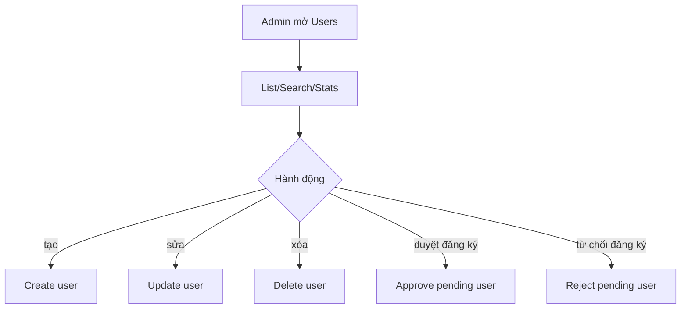
```mermaid
flowchart TD
    A[Admin mở Users] --> B[List/Search/Stats]
    B --> C{Hành động}
    C -- tạo --> D[Create user]
    C -- sửa --> E[Update user]
    C -- xóa --> F[Delete user]
    C -- duyệt đăng ký --> G[Approve pending user]
    C -- từ chối đăng ký --> H[Reject pending user]
```

### 6. Profile / Change Password Flow

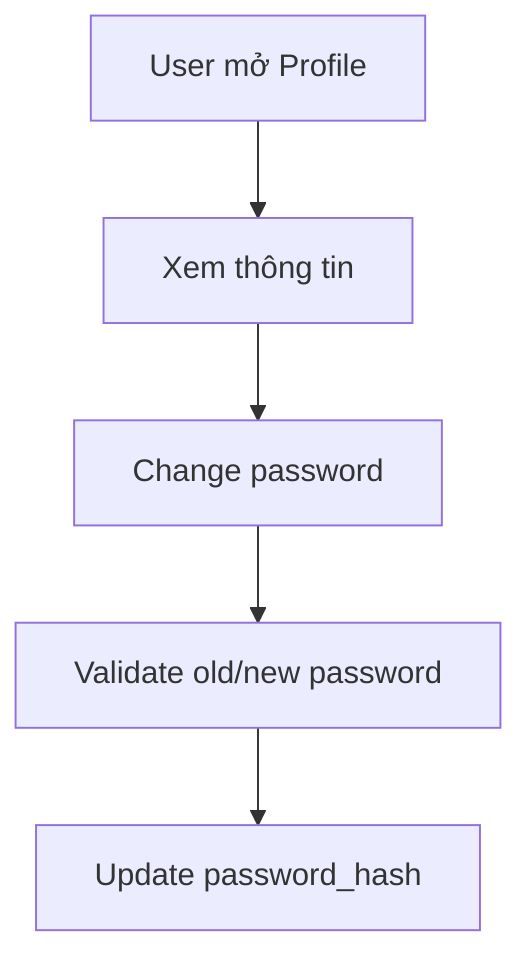
```mermaid
flowchart TD
    A[User mở Profile] --> B[Xem thông tin]
    B --> C[Change password]
    C --> D[Validate old/new password]
    D --> E[Update password_hash]
```

### 7. Department Management Flow

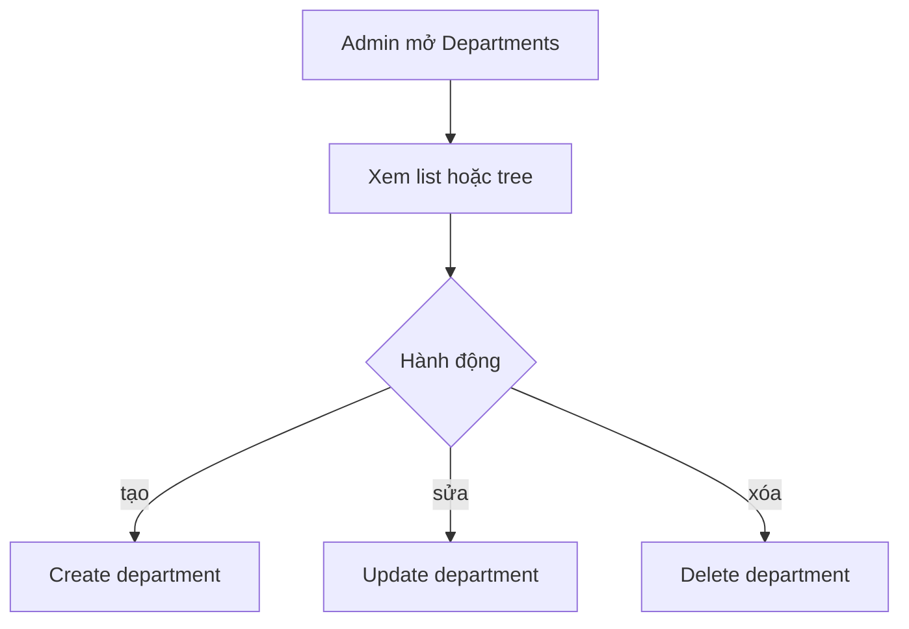
```mermaid
flowchart TD
    A[Admin mở Departments] --> B[Xem list hoặc tree]
    B --> C{Hành động}
    C -- tạo --> D[Create department]
    C -- sửa --> E[Update department]
    C -- xóa --> F[Delete department]
```

### 8. Position Management Flow

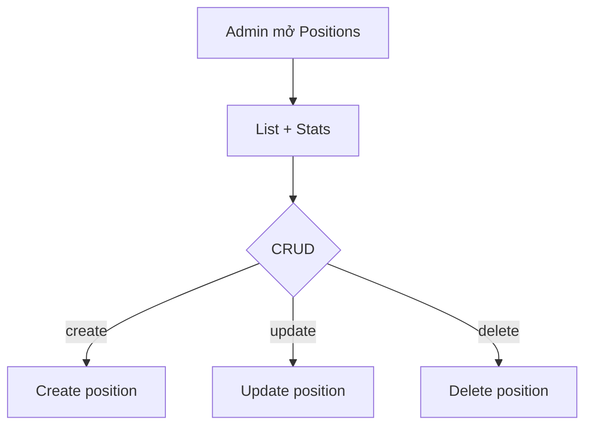
```mermaid
flowchart TD
    A[Admin mở Positions] --> B[List + Stats]
    B --> C{CRUD}
    C -- create --> D[Create position]
    C -- update --> E[Update position]
    C -- delete --> F[Delete position]
```

### 9. Roles & Permissions Flow

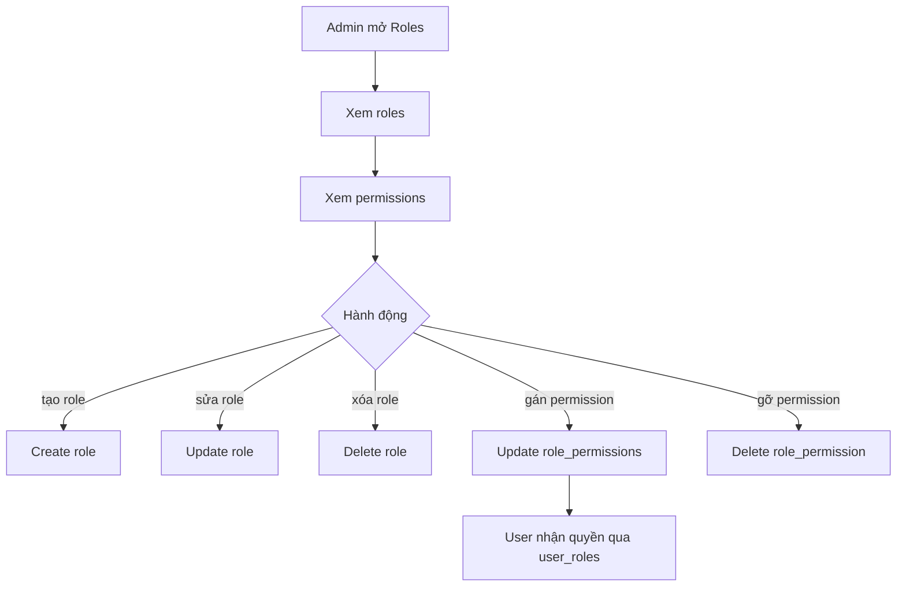
```mermaid
flowchart TD
    A[Admin mở Roles] --> B[Xem roles]
    B --> C[Xem permissions]
    C --> D{Hành động}
    D -- tạo role --> E[Create role]
    D -- sửa role --> F[Update role]
    D -- xóa role --> G[Delete role]
    D -- gán permission --> H[Update role_permissions]
    D -- gỡ permission --> I[Delete role_permission]
    H --> J[User nhận quyền qua user_roles]
```

### 10. Document Type Flow

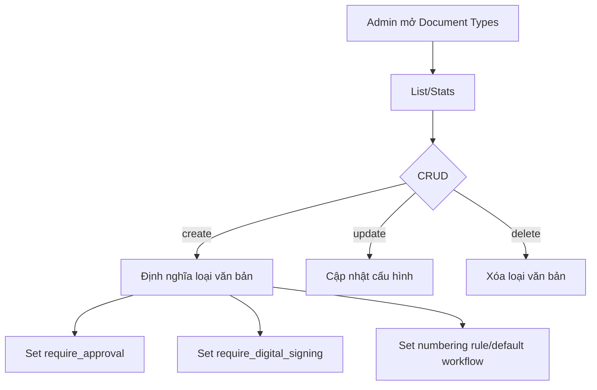
```mermaid
flowchart TD
    A[Admin mở Document Types] --> B[List/Stats]
    B --> C{CRUD}
    C -- create --> D[Định nghĩa loại văn bản]
    D --> E[Set require_approval]
    D --> F[Set require_digital_signing]
    D --> G[Set numbering rule/default workflow]
    C -- update --> H[Cập nhật cấu hình]
    C -- delete --> I[Xóa loại văn bản]
```

### 11. Numbering Flow

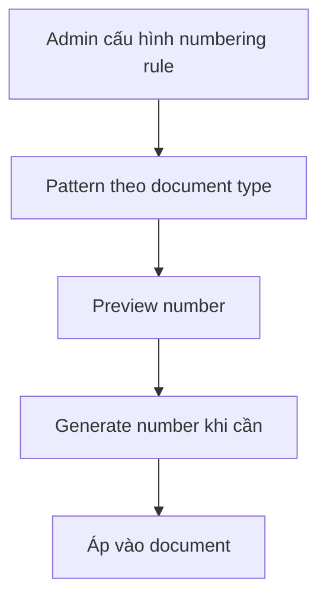
```mermaid
flowchart TD
    A[Admin cấu hình numbering rule] --> B[Pattern theo document type]
    B --> C[Preview number]
    C --> D[Generate number khi cần]
    D --> E[Áp vào document]
```

### 12. Workflow Template Flow

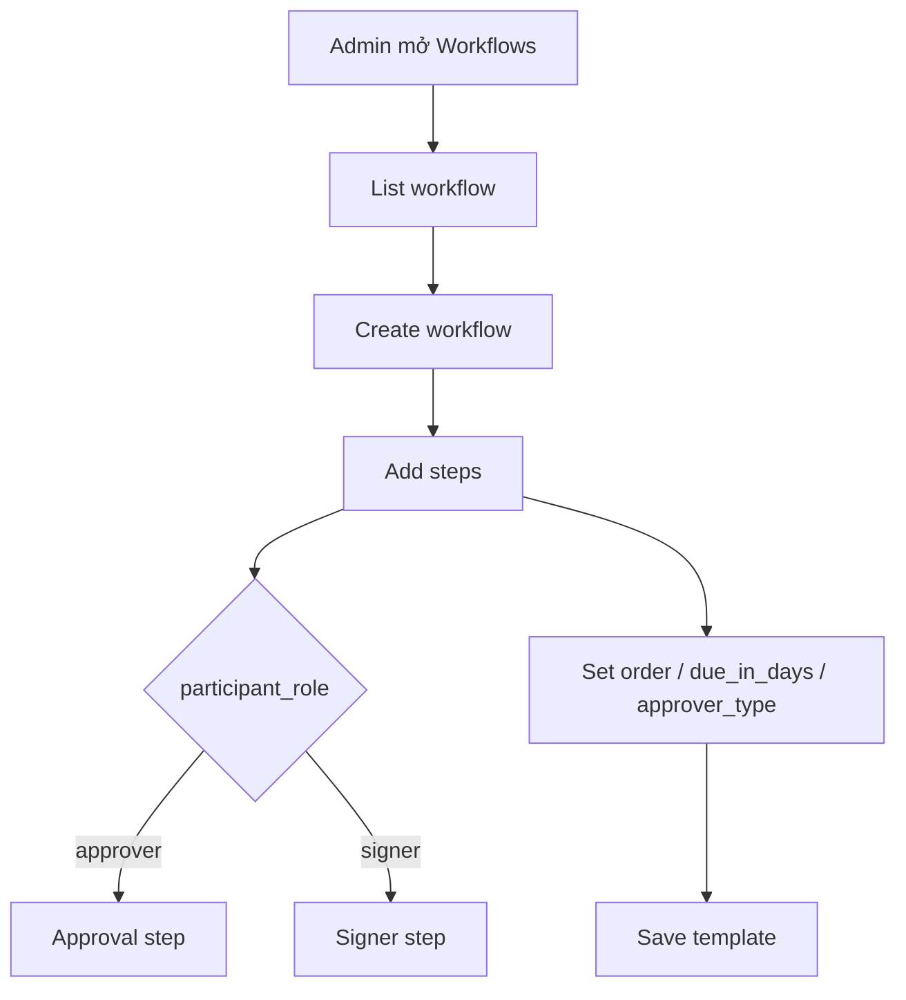
```mermaid
flowchart TD
    A[Admin mở Workflows] --> B[List workflow]
    B --> C[Create workflow]
    C --> D[Add steps]
    D --> E{participant_role}
    E -- approver --> F[Approval step]
    E -- signer --> G[Signer step]
    D --> H[Set order / due_in_days / approver_type]
    H --> I[Save template]
```

### 13. Document Creation Flow

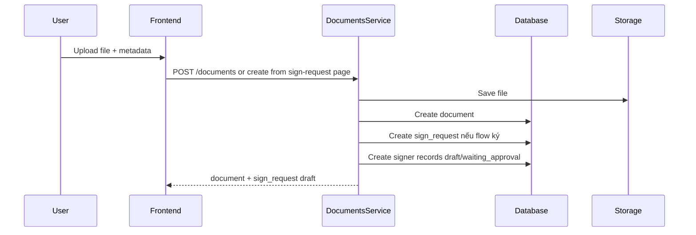
```mermaid
sequenceDiagram
    participant U as User
    participant FE as Frontend
    participant BE as DocumentsService
    participant DB as Database
    participant FS as Storage

    U->>FE: Upload file + metadata
    FE->>BE: POST /documents or create from sign-request page
    BE->>FS: Save file
    BE->>DB: Create document
    BE->>DB: Create sign_request nếu flow ký
    BE->>DB: Create signer records draft/waiting_approval
    BE-->>FE: document + sign_request draft
```

### 14. Document Access Flow

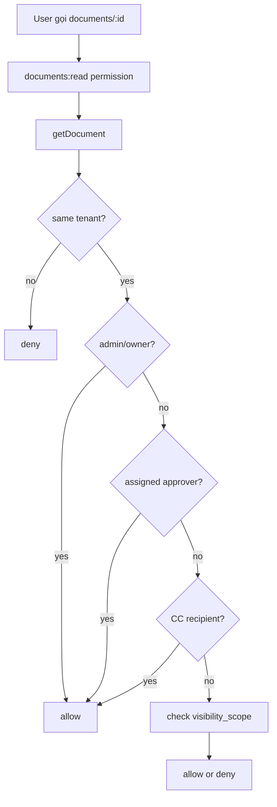
```mermaid
flowchart TD
    A[User gọi documents/:id] --> B[documents:read permission]
    B --> C[getDocument]
    C --> D{same tenant?}
    D -- no --> E[deny]
    D -- yes --> F{admin/owner?}
    F -- yes --> G[allow]
    F -- no --> H{assigned approver?}
    H -- yes --> G
    H -- no --> I{CC recipient?}
    I -- yes --> G
    I -- no --> J[check visibility_scope]
    J --> K[allow or deny]
```

### 15. Document Lifecycle Flow

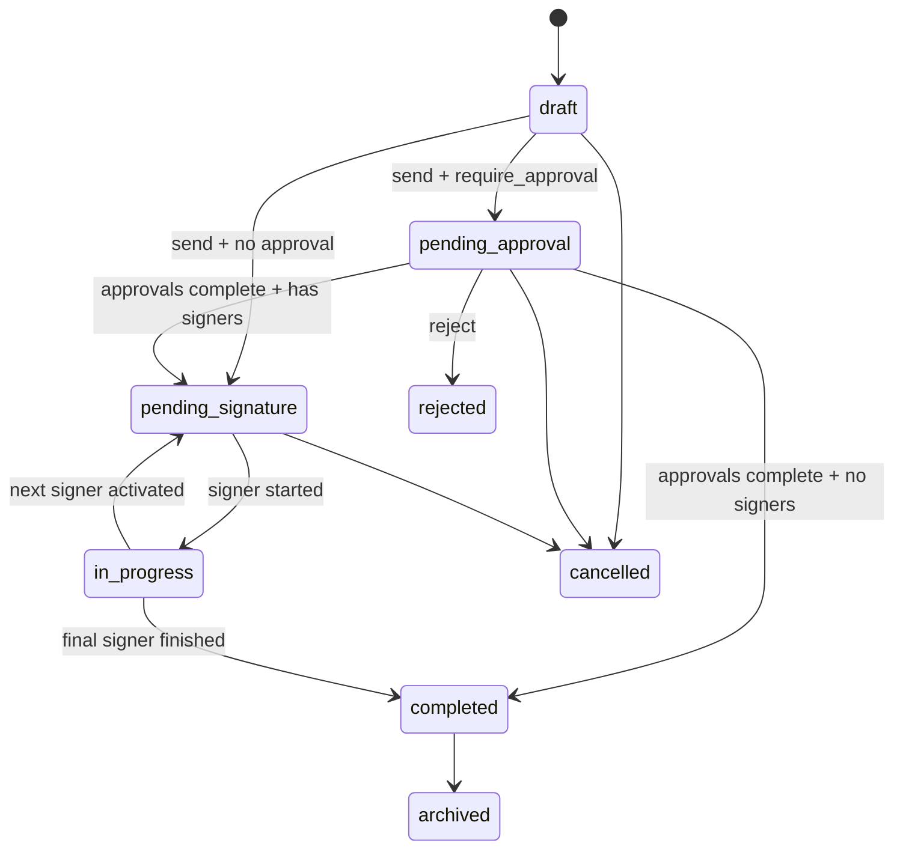
```mermaid
stateDiagram-v2
    [*] --> draft
    draft --> pending_approval: send + require_approval
    draft --> pending_signature: send + no approval
    pending_approval --> pending_signature: approvals complete + has signers
    pending_approval --> completed: approvals complete + no signers
    pending_approval --> rejected: reject
    pending_signature --> in_progress: signer started
    in_progress --> pending_signature: next signer activated
    in_progress --> completed: final signer finished
    draft --> cancelled
    pending_approval --> cancelled
    pending_signature --> cancelled
    completed --> archived
```

### 16. Sign Request Draft Flow

```mermaid
flowchart TD
    A[/sign-requests/create] --> B[Tạo document + sign_request draft]
    B --> C[/sign-requests/:id/editor]
    C --> D[Thêm/sửa signer]
    C --> E[Đặt field ký]
    C --> F[Lưu nháp nhiều lần]
    D --> G[Bấm gửi]
    E --> G
    F --> G
```

### 17. Editor Flow

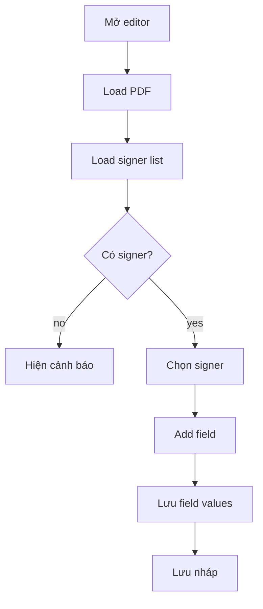
```mermaid
flowchart TD
    A[Mở editor] --> B[Load PDF]
    B --> C[Load signer list]
    C --> D{Có signer?}
    D -- no --> E[Hiện cảnh báo]
    D -- yes --> F[Chọn signer]
    F --> G[Add field]
    G --> H[Lưu field values]
    H --> I[Lưu nháp]
```

### 18. Submit Sign Request Flow

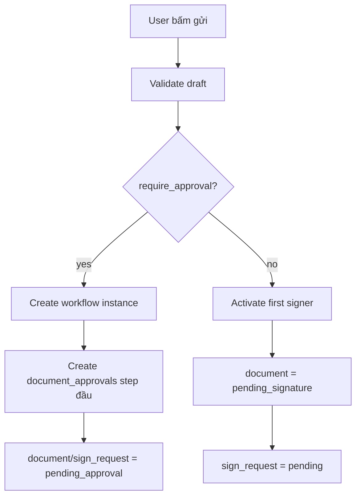
```mermaid
flowchart TD
    A[User bấm gửi] --> B[Validate draft]
    B --> C{require_approval?}
    C -- yes --> D[Create workflow instance]
    D --> E[Create document_approvals step đầu]
    E --> F[document/sign_request = pending_approval]
    C -- no --> G[Activate first signer]
    G --> H[document = pending_signature]
    H --> I[sign_request = pending]
```

### 19. Approval Execution Flow

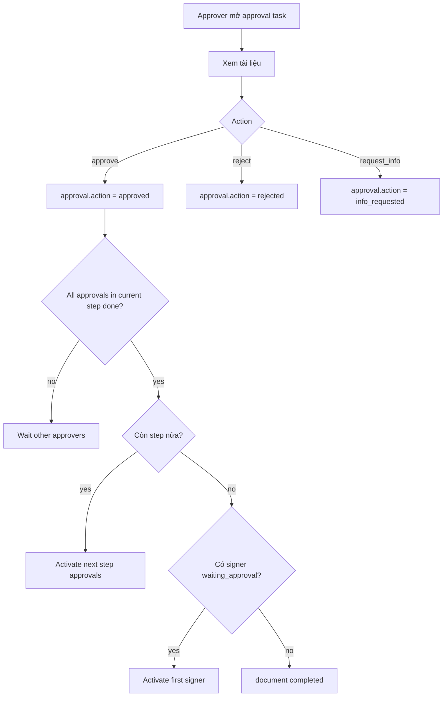
```mermaid
flowchart TD
    A[Approver mở approval task] --> B[Xem tài liệu]
    B --> C{Action}
    C -- approve --> D[approval.action = approved]
    C -- reject --> E[approval.action = rejected]
    C -- request_info --> F[approval.action = info_requested]
    D --> G{All approvals in current step done?}
    G -- no --> H[Wait other approvers]
    G -- yes --> I{Còn step nữa?}
    I -- yes --> J[Activate next step approvals]
    I -- no --> K{Có signer waiting_approval?}
    K -- yes --> L[Activate first signer]
    K -- no --> M[document completed]
```

### 20. Approval Document Preview Flow

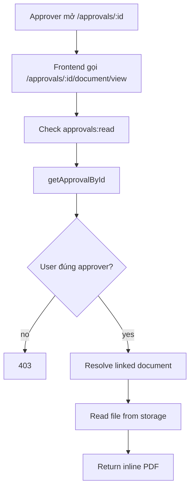
```mermaid
flowchart TD
    A[Approver mở /approvals/:id] --> B[Frontend gọi /approvals/:id/document/view]
    B --> C[Check approvals:read]
    C --> D[getApprovalById]
    D --> E{User đúng approver?}
    E -- no --> F[403]
    E -- yes --> G[Resolve linked document]
    G --> H[Read file from storage]
    H --> I[Return inline PDF]
```

### 21. My Tasks Aggregation Flow

```mermaid
flowchart TD
    A[/my-tasks] --> B[Load approval tasks]
    A --> C[Load signing tasks]
    B --> D[Normalize task shape]
    C --> D
    D --> E[Merge]
    E --> F[Sort/filter/paginate]
    F --> G[Render unified task list]
```

### 22. Internal Signing Flow

```mermaid
flowchart TD
    A[Internal signer mở task] --> B[Load sign_request + my signer]
    B --> C[Load PDF]
    C --> D[Load my fields]
    D --> E[Điền field / ký]
    E --> F[POST sign]
    F --> G[signer = signed]
    G --> H{Còn signer tiếp theo?}
    H -- yes --> I[Activate next signer]
    H -- no --> J[sign_request/document = completed]
```

### 23. External Signing Flow

```mermaid
flowchart TD
    A[Signer nhận email link] --> B[/public/sign/:token or /sign/:token]
    B --> C[Validate token]
    C --> D[Send OTP]
    D --> E[Verify OTP]
    E --> F[Load document + fields]
    F --> G[Signer ký]
    G --> H[Update signer status]
    H --> I{Final signer?}
    I -- yes --> J[Generate signed PDF + complete]
    I -- no --> K[Activate next signer]
```

### 24. Progressive PDF Generation Flow

```mermaid
flowchart TD
    A[Signer/approval action complete] --> B[Load original PDF]
    B --> C[Load field values]
    C --> D[Draw signatures/text/date/checkbox]
    D --> E[Optional watermark]
    E --> F[Optional audit trail page]
    F --> G[Write signed file to storage]
```

### 25. Public Sign Access Flow

```mermaid
flowchart TD
    A[Public request with token] --> B[Lookup signer by token]
    B --> C{Token valid and signer active?}
    C -- no --> D[deny]
    C -- yes --> E[Return sign request + document]
```

### 26. Notification Flow

```mermaid
flowchart TD
    A[Business event] --> B{Event type}
    B -- approval request --> C[Create approval notification]
    B -- signer activated --> D[Create signing notification]
    B -- document approved/rejected --> E[Create result notification]
    C --> F[Unread count]
    D --> F
    E --> F
```

### 27. Audit Flow

```mermaid
flowchart TD
    A[Business action] --> B[Create audit log]
    B --> C[Store actor]
    B --> D[Store event]
    B --> E[Store target type/id]
    B --> F[Store timestamp/IP/userAgent]
```

### 28. External Organization Flow

```mermaid
flowchart TD
    A[Admin/User có quyền mở External Orgs] --> B[List/Stats]
    B --> C{CRUD}
    C -- create --> D[Tạo đối tác/cơ quan]
    C -- update --> E[Sửa thông tin]
    C -- delete --> F[Xóa bản ghi]
```

### 29. Settings Flow

```mermaid
flowchart TD
    A[Admin mở Settings] --> B{Nhóm cấu hình}
    B -- email --> C[SMTP config]
    B -- watermark --> D[Watermark config]
    B -- system --> E[General settings]
    C --> F[Test email]
    D --> G[Áp dụng lên PDF generation]
```

### 30. Webhook Flow

```mermaid
flowchart TD
    A[Admin cấu hình webhook] --> B[Create webhook endpoint]
    B --> C[Business event xảy ra]
    C --> D[Build payload]
    D --> E[POST tới endpoint]
    E --> F[Log result / retry policy nếu có]
```

### 31. Document Flow Timeline

```mermaid
flowchart TD
    A[Document] --> B[Load workflow_instance]
    A --> C[Load approvals]
    A --> D[Load signers]
    B --> E[Build phases]
    C --> E
    D --> E
    E --> F[Unified flow timeline]
```

### 32. Tenant / License Flow

```mermaid
flowchart TD
    A[Request tạo document hoặc thao tác tenant-bound] --> B[Check tenant context]
    B --> C[License service enforce limit]
    C --> D{License valid?}
    D -- no --> E[deny]
    D -- yes --> F[Continue business action]
```

## Phần 2. Bản Dễ Đọc Cho Người Dùng Và Nghiệp Vụ

### 1. Hành trình chung của một văn bản

```mermaid
flowchart TD
    A[Tạo văn bản] --> B[Hoàn thiện nội dung]
    B --> C[Thêm người ký nếu cần]
    C --> D[Gửi quy trình]
    D --> E{Có phê duyệt trước không?}
    E -- có --> F[Người duyệt xử lý]
    E -- không --> G[Người ký xử lý]
    F --> H{Duyệt xong hết chưa?}
    H -- chưa --> F
    H -- rồi --> G
    G --> I{Đã ký hết chưa?}
    I -- chưa --> G
    I -- rồi --> J[Hoàn tất]
```

### 2. Góc nhìn của người tạo văn bản

```mermaid
flowchart TD
    A[Upload file] --> B[Chọn loại văn bản]
    B --> C[Chọn quy trình nếu cần]
    C --> D[Tạo nháp]
    D --> E[Vào màn chỉnh sửa]
    E --> F[Thêm người ký]
    E --> G[Đặt vị trí ký]
    F --> H[Bấm gửi]
    G --> H
```

### 3. Góc nhìn của người phê duyệt

```mermaid
flowchart TD
    A[Nhận việc trong My Tasks] --> B[Mở chi tiết phê duyệt]
    B --> C[Xem tài liệu]
    C --> D{Quyết định}
    D -- phê duyệt --> E[Chuyển sang bước tiếp]
    D -- từ chối --> F[Dừng quy trình]
    D -- yêu cầu bổ sung --> G[Trả lại cho người tạo]
```

### 4. Góc nhìn của người ký nội bộ

```mermaid
flowchart TD
    A[Nhận việc ký] --> B[Mở màn ký]
    B --> C[Xem tài liệu và vị trí ký]
    C --> D[Ký]
    D --> E[Gửi kết quả]
    E --> F{Còn người ký sau không?}
    F -- có --> G[Chờ người tiếp theo]
    F -- không --> H[Hoàn tất]
```

### 5. Góc nhìn của người ký bên ngoài

```mermaid
flowchart TD
    A[Nhận link qua email] --> B[Mở link]
    B --> C[Nhập OTP]
    C --> D[Xem tài liệu]
    D --> E[Ký]
    E --> F[Hoàn thành phần ký của mình]
```

### 6. Quản lý người dùng

```mermaid
flowchart TD
    A[Admin mở màn người dùng] --> B[Xem danh sách]
    B --> C[Thêm tài khoản]
    B --> D[Sửa thông tin]
    B --> E[Duyệt tài khoản chờ]
    B --> F[Xóa hoặc khóa tài khoản]
```

### 7. Quản lý phòng ban và chức danh

```mermaid
flowchart TD
    A[Admin quản lý tổ chức] --> B[Phòng ban]
    A --> C[Chức danh]
    B --> D[Tạo/sửa/xóa phòng ban]
    C --> E[Tạo/sửa/xóa chức danh]
```

### 8. Quản lý vai trò và quyền

```mermaid
flowchart TD
    A[Admin quản lý vai trò] --> B[Tạo vai trò]
    B --> C[Gán quyền cho vai trò]
    C --> D[Gán vai trò cho người dùng]
```

### 9. Cấu hình loại văn bản

```mermaid
flowchart TD
    A[Admin tạo loại văn bản] --> B[Đặt quy tắc]
    B --> C[Có cần phê duyệt không]
    B --> D[Có cần ký điện tử không]
    B --> E[Có đánh số tự động không]
```

### 10. Cấu hình quy trình

```mermaid
flowchart TD
    A[Admin tạo workflow] --> B[Thêm từng bước]
    B --> C[Bước duyệt]
    B --> D[Bước ký]
    C --> E[Lưu template]
    D --> E
```

### 11. Đánh số văn bản

```mermaid
flowchart TD
    A[Loại văn bản có numbering] --> B[Hệ thống preview số]
    B --> C[Khi cần sẽ generate số thật]
    C --> D[Áp lên văn bản]
```

### 12. Quản lý tài liệu

```mermaid
flowchart TD
    A[Người dùng vào Documents] --> B[Xem danh sách]
    B --> C[Xem chi tiết]
    B --> D[Tải file]
    B --> E[Xem flow]
    B --> F[Lưu trữ hoặc hủy]
```

### 13. Màn My Tasks

```mermaid
flowchart TD
    A[My Tasks] --> B[Việc cần duyệt]
    A --> C[Việc cần ký]
    B --> D[Mở màn phê duyệt]
    C --> E[Mở màn ký]
```

### 14. Thông báo

```mermaid
flowchart TD
    A[Hệ thống phát sinh sự kiện] --> B[Gửi thông báo trong app]
    B --> C[Người dùng xem danh sách]
    C --> D[Đánh dấu đã đọc]
```

### 15. Nhật ký hoạt động

```mermaid
flowchart TD
    A[Người dùng thao tác] --> B[Hệ thống ghi audit]
    B --> C[Admin hoặc người có quyền xem lịch sử]
```

### 16. Tổ chức ngoài

```mermaid
flowchart TD
    A[Quản lý tổ chức ngoài] --> B[Thêm đối tác/cơ quan]
    B --> C[Sửa thông tin]
    C --> D[Dùng lại trong nghiệp vụ tài liệu]
```

### 17. Cài đặt hệ thống

```mermaid
flowchart TD
    A[Admin vào Settings] --> B[Cấu hình email]
    A --> C[Cấu hình watermark]
    A --> D[Cấu hình chung]
```

### 18. Webhook

```mermaid
flowchart TD
    A[Admin cấu hình webhook] --> B[Hệ thống ghi nhận sự kiện]
    B --> C[Gửi payload ra ngoài]
    C --> D[Hệ thống bên ngoài nhận kết quả]
```

### 19. Ai xem được tài liệu ở từng bước

```mermaid
flowchart TD
    A[Người tạo] --> B[Xem và sửa khi còn nháp]
    C[Người duyệt] --> D[Xem tài liệu được giao để duyệt]
    E[Người ký] --> F[Xem tài liệu khi tới lượt ký]
    G[Admin] --> H[Xem theo quyền quản trị]
```

### 20. Ý nghĩa các trạng thái chính

```mermaid
flowchart TD
    A[Nháp] --> B[Chờ phê duyệt]
    A --> C[Chờ ký]
    B --> C
    B --> D[Bị từ chối]
    C --> E[Đang ký]
    E --> F[Hoàn tất]
    A --> G[Đã hủy]
    B --> G
    C --> G
```

## Cách dùng tài liệu này

- Khi sửa code: đọc phần cho dev trước.
- Khi mô tả sản phẩm cho tester, BA, user: dùng phần cho người dùng/nghiệp vụ.
- Khi thêm module mới, cập nhật:
  - `docs/business-flows.md`
  - `FUNCTIONAL_SPEC.md`
  - `docs/README.md` nếu có tài liệu mới liên quan
