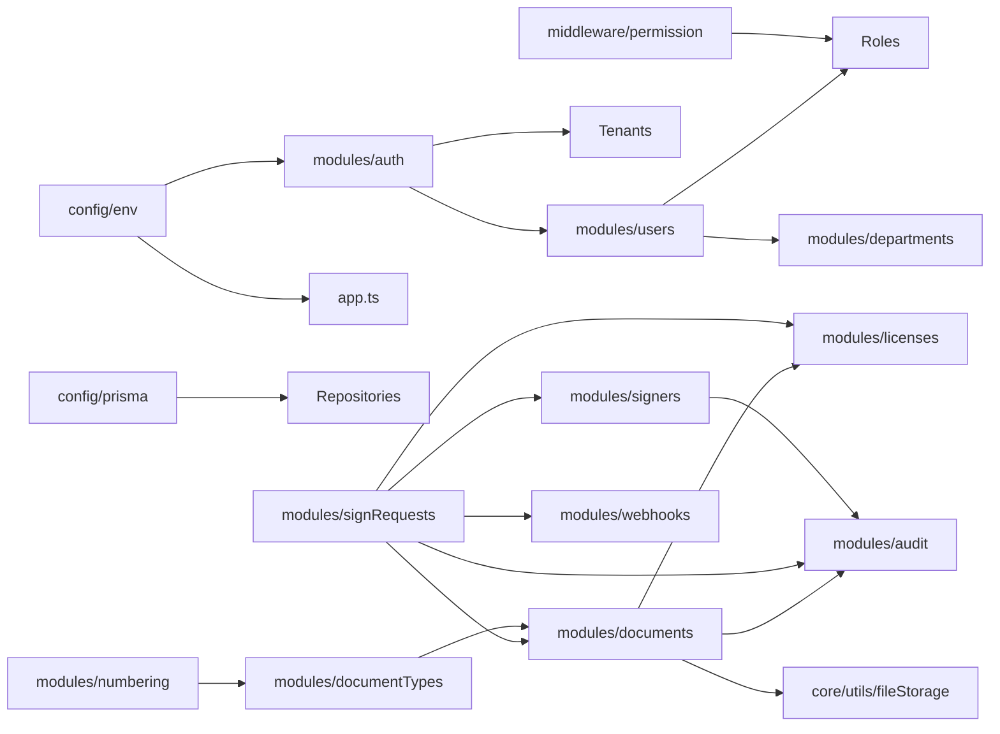

# Bản đồ module & phụ thuộc (tóm tắt)

Tài liệu này liệt kê các module chính của backend, frontend và mối phụ thuộc quan trọng giữa chúng ở mức high‑level.

---

## 1. Backend modules

- **Core & config**
  - `config/env.ts` – biến môi trường.
  - `config/prisma.ts` – PrismaClient.
  - `core/errors/api-error.ts` – lỗi chuẩn.
  - `core/middlewares/errorHandler.ts`, `requestContext.ts`.
  - `core/utils/asyncHandler.ts`, `response.ts`, `fileStorage.ts`.
  - `middleware/permission.ts` – RBAC middleware.

- **Auth & Tenant**
  - `modules/auth` – login, refresh, `authGuard`.
  - `modules/tenants` – `/tenants/me`.

- **RBAC & tổ chức**
  - `modules/users` – CRUD user, profile, stats.
  - `modules/departments` – cây phòng ban.
  - `modules/roles` – roles & permissions, user_roles.

- **E‑Signature core**
  - `modules/documents` – upload, list, delete tài liệu.
  - `modules/signRequests` – tạo/list/cancel yêu cầu ký.
  - `modules/signers` – thêm signer, gửi OTP, ký.
  - `modules/audit` – audit logs cho documents.
  - `modules/webhooks` – đăng ký & emit webhook.

- **E‑Office foundation**
  - `modules/documentTypes` – loại văn bản, stats.
  - `modules/numbering` – rule đánh số, generate/preview.

- **License**
  - `modules/licenses` – kiểm tra license on‑prem, giới hạn user/docs.

---

## 2. Frontend modules

- `components/providers/app-providers.tsx`
  - Khởi tạo `QueryClient`, bọc `AuthProvider`.

- `components/providers/auth-provider.tsx`
  - Auth context: `user`, `tenant`, `tokens`, `login`, `logout`, `fetchJson`.
  - Quản lý session trong localStorage (key `esign.auth`).

- `app/(auth)/login/page.tsx`
  - Form login → gọi `POST /auth/login`, lưu session qua `AuthProvider`.

- `app/(dashboard)/layout.tsx`
  - Layout bảo vệ: nếu không có token → redirect `/login`.
  - Sidebar chứa navigation tới `/documents`, `/sign-requests`, `/users`, `/departments`, `/roles`, `/document-types`, `/webhooks`, `/settings/...`.

- Các page chính:
  - `/documents` – upload file (base64) + list docs.
  - `/sign-requests` – tạo & list sign requests.
  - `/document-types` – quản lý loại văn bản (hiện đang tự dùng `localStorage.getItem('token')`).
  - `/users`, `/departments`, `/roles`, `/webhooks`, `/settings/...`.

---

## 3. Sơ đồ phụ thuộc module (backend – giản lược)

---

## 4. Nơi chứa “global state”

- Backend:
  - `env` (object từ `config/env.ts`).
  - `prisma` (singleton).
  - Các singleton service (`authService`, `licenseService`, `emailService`, `auditService`, `webhookService`,...).
  - `req.context`, `req.auth`, `req.user`, `req.tenant` (được gắn qua middleware).

- Frontend:
  - `AuthContext` trong `auth-provider.tsx` (React context).
  - `localStorage["esign.auth"]` để persist session.

